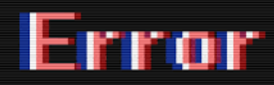

# UMMI

## Issue 1

* a. Error:



* b. Troubleshooting:
```console
root@master:~$ whoami

```
* c. Cause: 

Name | Effection Level | Description 
- | :-: | -: 
Cause 1 | 1 | Description 1 
Cause 2 | 1 | Description 2 
Cause 3 | 2 | Description 3


* d. Solution:

[data1.zip](files/data1.zip)

##  Issue 2

* a. Error:
* b. Cause: Unknown issue
* c. Solution: N/A

